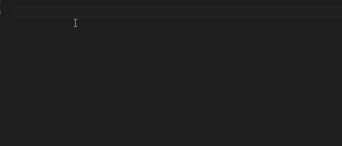

# bitrix-snippet README

 

Сниппеты Bitrix для Visual Studio Code Editor, портированные из [bitrix-snippets](https://atom.io/packages/bitrix-snippets), спасибо anyzicky

*На других языках: [English](README.md), [Русский](README.ru.md).*

## Использование

Просто начните набирать что-нибудь типа CIBlock и нажмите Enter.
Используйте префикс d7 для использования нового [D7 API](https://dev.1c-bitrix.ru/api_d7/).
Используйте префикс bx для общих сниппетов, такие как подключение пролога.

Если вы не работаете в каталоге Bitrix, то есть не подключаете его в рабочую область, а правите отдельные файлы по FTP, но хотите получать подсказки IDE по функциям и их параметрам, то включите настройку Hint-function в разделе Bitrix snippet settings настроек VSCode. Это включит автоматическое подключение каталога с заглушками и описаниями функций битрикса в вашу рабочую область. Возможно потребуется дополнительная перезагрузка редактора и переоткрытие файла для переиндексации и работы подсказок.

## Установка

1. Установите Visual Studio Code 1.28.0 или выше
1. Запустите редактор
1. Откройте командную строку сочетанием клавиш `Ctrl`-`Shift`-`P` (Windows, Linux) или `Cmd`-`Shift`-`P` (OSX)
1. Выберите (или наберите) `Install Extension`
1. Введите Bitrix Snippet
1. Перезапустите Visual Studio Code

### TODO

- [] Добавить заглушки ко всем функциям и классам Битрикса.
